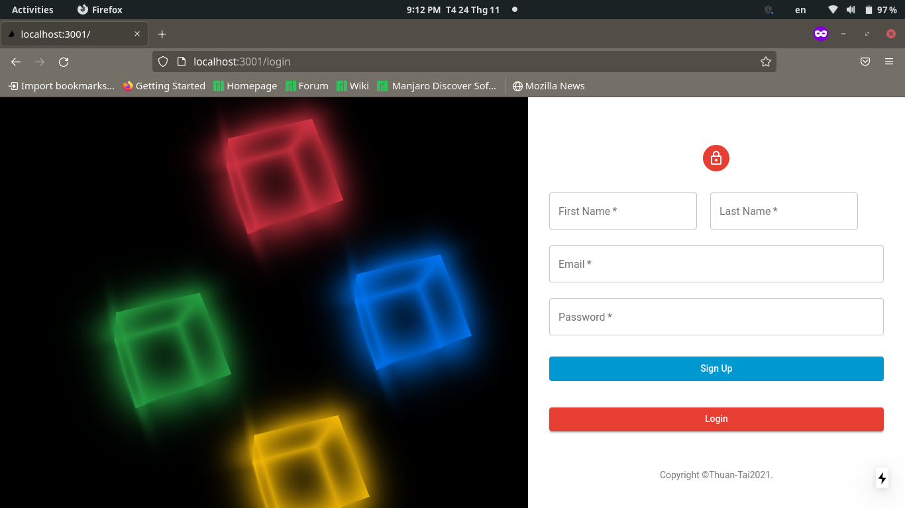
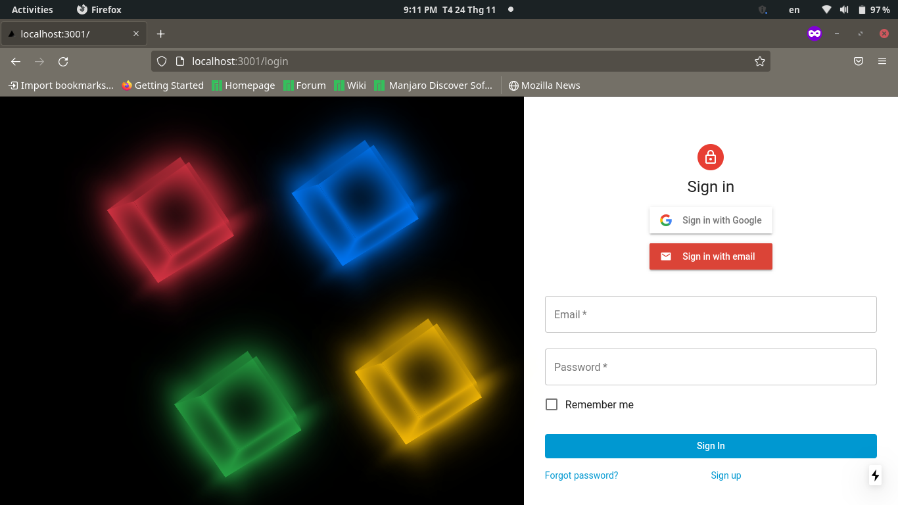
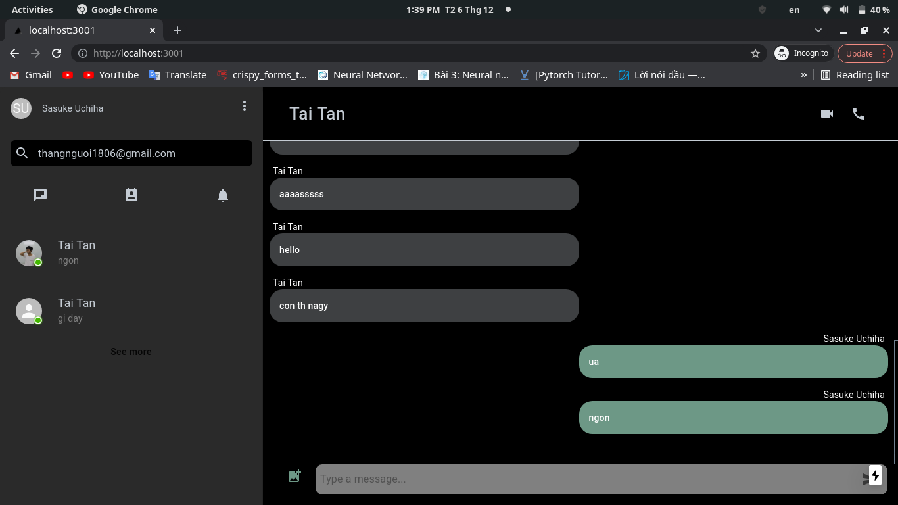
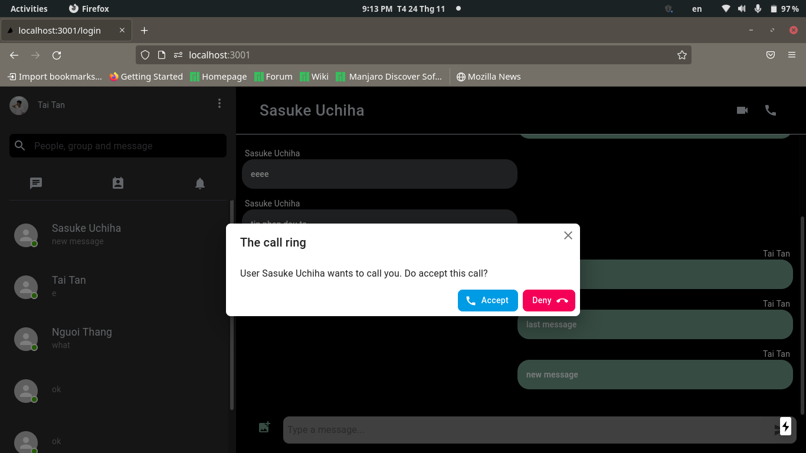
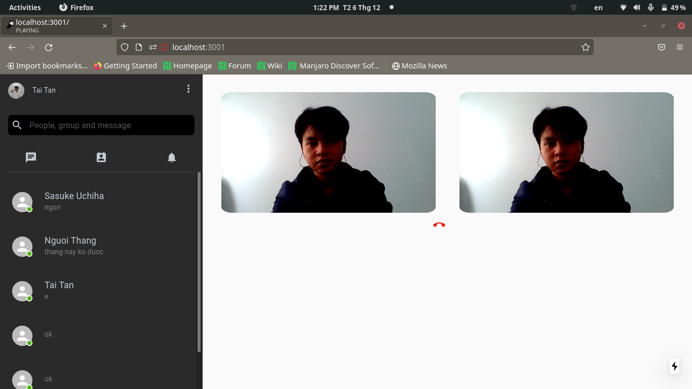

# **Chatting-app**

## **Description**

---

Simple web application chatting using webRTC and Socket.io. Only available working with P2P(Peer to peer) connection with STUN server, currently not support TURN server.

### _Techonology using include_


## **Table of Contents**

- [Getting Started](#getting-started)
- [Usage](#usage)
- [Authors](#authors)
- [Acknowledgments](#acknowledgments)

## **Getting Started**

---

### Prerequisites

This is an example of how you may give instructions on setting up your project locally. To get a local copy up and running follow these simple example steps.

> npm

```properties
npm install npm@latest -g
```

> docker

```properties
curl -fsSL https://get.docker.com -o get-docker.sh
sudo sh get-docker.sh
```

### _Installation_

#### Clone Repository

```properties
git clone https://github.com/thuanhong/chatting-app

```

#### Server side

<br>

```properties
## change directory to folder backend/
npm install
docker-compose -f docker-compose.back-end.yml

```

#### Client side

```properties
## change directory to folder frontend/

npm install
```

## **Usage**

---

<br/>

### _Sign up_


<br/>

### _Login_


<br/>

### _Add contact_


<br/>

### _Chat message_


<br/>

### _Pick up phone call_


<br/>

### _Feature video call_


<br/>

## **Authors**

---


<br/>

Ho Tan Tai [](https://www.linkedin.com/in/hotai1806)


<br/>

Hong Thanh Thuan

# Acknowledgments

Consult knowledge from all this pages

- [Socket io](https://socket.io/docs/v4/)

- [WebRTC](https://developer.mozilla.org/en-US/docs/Web/API/WebRTC_API)
